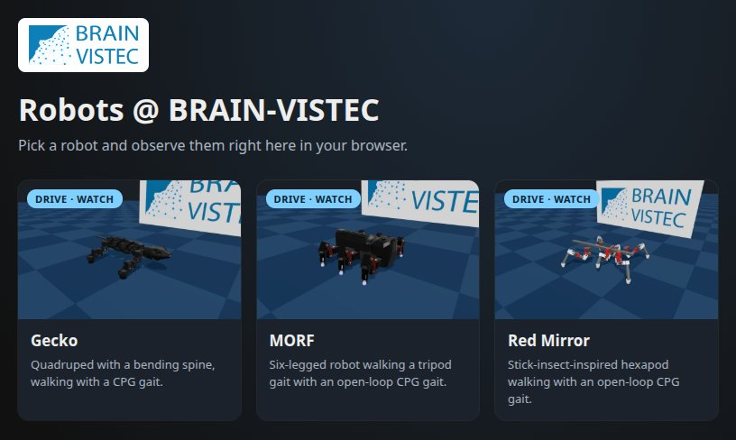
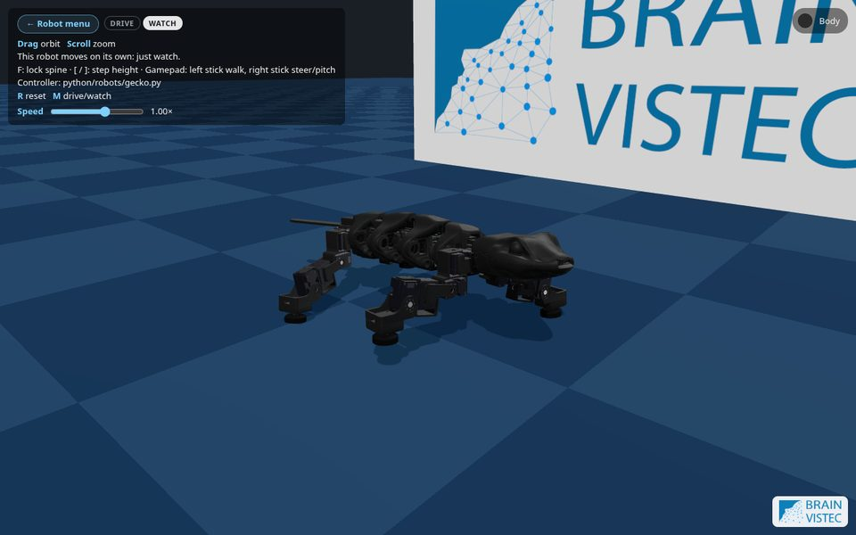
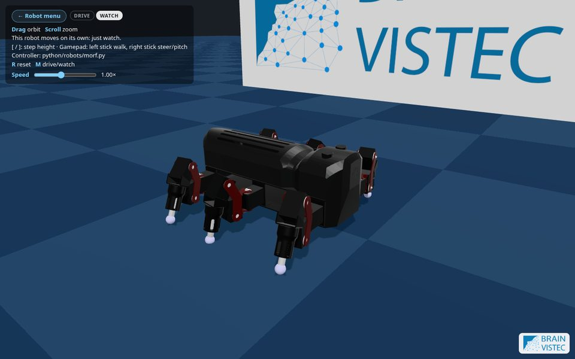
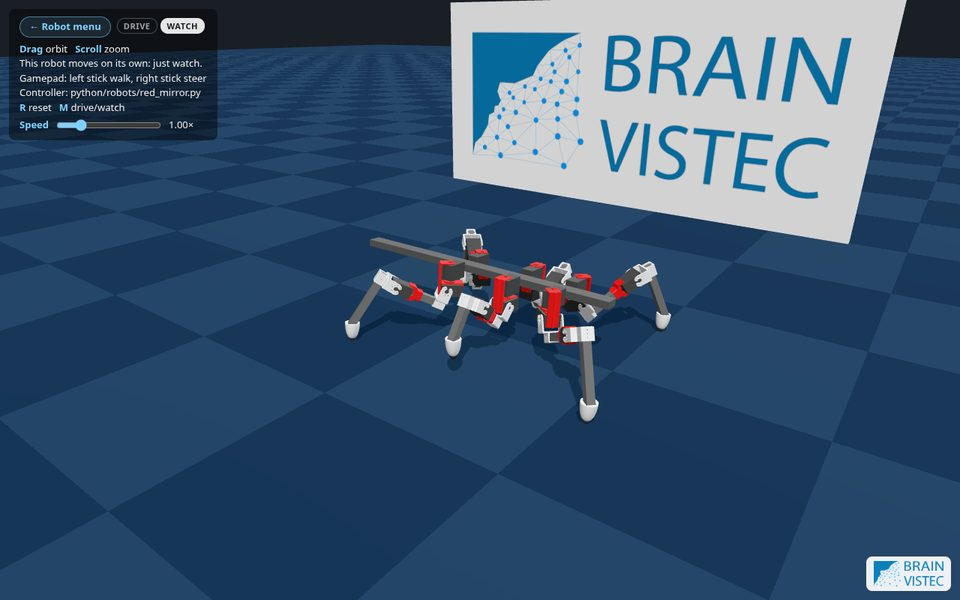

# MuJoCo Web Simulator

A browser-based MuJoCo simulator for legged robots. MuJoCo compiled to
WebAssembly runs the physics entirely client-side and Three.js renders it,
so there is no backend: the site is static files.

Robot controllers are written in **Python**. The page runs them in the
browser with [Pyodide](https://pyodide.org), and the same file runs on the
desktop with native MuJoCo for debugging. Adding a robot needs no
JavaScript: **one MJCF model plus one Python file**.



## Robots

| Gecko | MORF | Red Mirror |
| --- | --- | --- |
|  |  |  |

| Robot | Link | Brought in from |
| --- | --- | --- |
| Gecko, a quadruped with a bending spine | `?robot=gecko` | Isaac Sim USD |
| MORF hexapod | `?robot=morf` | CoppeliaSim scene |
| Red Mirror, a stick-insect hexapod | `?robot=red_mirror` | CoppeliaSim scene |
| Unitree B1 quadruped (hidden, work in progress) | `?robot=b1` | URDF |

Each can be driven with the keyboard, a gamepad or a touch joystick, or
left to walk on its own in Watch mode.

## Quick start

```sh
npm install
npm run dev                              # open http://localhost:5173 and pick a robot

pip install mujoco
python python/run_local.py gecko         # the same robot in MuJoCo's desktop viewer
```

## Adding a new robot

A robot is two files. The file name `<name>` becomes its URL, `?robot=<name>`.

| File | What it is |
| --- | --- |
| `public/assets/<name>/<name>.xml` (+ meshes) | the MuJoCo model (MJCF) |
| `python/robots/<name>.py` | the controller: `step(obs)` returns `{actuator name: target}` |

Once both exist, the robot shows up in the page's menu.

**1. Get an MJCF model.** The easiest way is the converter page: pick the
description type (URDF, CoppeliaSim scene, Isaac Sim USD), drop in the files,
convert, and check the result in its URDF and MuJoCo viewers:

```sh
venv/bin/python tools/converter/server.py          # open http://localhost:8010/
```

See [docs/converter.md](docs/converter.md).

Or convert from the command line:

```sh
# from a CoppeliaSim scene (how MORF and Red Mirror were made)
tools/coppeliasim/export_urdf.sh path/to/Robot.ttt /robot_root     # -> assets_src/Robot/urdf/
tools/coppeliasim/extract_scripts.sh path/to/Robot.ttt             # the scene's Lua controller
python tools/coppeliasim/urdf_to_mjcf.py assets_src/Robot/urdf/Robot.urdf   # -> assets_src/Robot/mujoco/

# from a URDF: the same urdf_to_mjcf.py; from an MJCF you already have: just copy it
```

**2. Clean up the model** and copy it to `public/assets/<name>/`. Check the
masses, remove joints the robot doesn't use, make sure the feet collide,
put collision shapes in `group="3"`, and shrink the meshes with
`tools/stl_to_msh.py`.

**3. Check that it stands** with the do-nothing template:

```sh
cp python/robots/_template.py python/robots/<name>.py    # set MODEL = "assets/<name>/<name>.xml"
python python/run_local.py <name>
```

**4. Write the controller**, porting the CoppeliaSim script if there is one.
It gets joystick input, joint positions and velocities, sensors and the
body's pose in `obs`, and returns actuator targets.

**5. Give it a menu card** (`TITLE`, `DESCRIPTION`, a thumbnail in
`public/assets/thumbs/`), then test and push:

```sh
python python/test_robots.py
npm run dev                                                # http://localhost:5173/?robot=<name>
```

The full walkthrough, with the clean-up checklist, how to port a CoppeliaSim
script and a troubleshooting table, is in
**[docs/adding-a-robot.md](docs/adding-a-robot.md)**.

## Future features

- [ ] **Closed-loop controllers with sensory feedback.** The gaits are
  currently open-loop, and those read the exact base pose from the simulator. None of the models have
  sensors yet. Add `<sensor>` blocks to the MJCF (IMU: `gyro`,
  `accelerometer`, `framequat`; foot contact: `touch`) so controllers can
  react to the readings in `obs.sensors`.
- [ ] **RL policy controllers using ONNX.** Run a trained policy exported to
  ONNX as a robot's controller, in the browser and on the desktop. Its inputs
  come from `obs` (joint state, sensors, joystick) and its outputs are the
  actuator targets.

## Documentation

| Document | Contents |
| --- | --- |
| [docs/adding-a-robot.md](docs/adding-a-robot.md) | Step-by-step tutorial for adding a robot |
| [python/README.md](python/README.md) | Controller API: every `obs` field and module setting |
| [docs/converter.md](docs/converter.md) | The converter page: converting a robot to MJCF in the browser, its viewers, how it works |
| [docs/model-tools.md](docs/model-tools.md) | The command-line converters: CoppeliaSim, URDF, USD, mesh compression |
| [docs/usage.md](docs/usage.md) | Running in the browser and on the desktop, controls, deployment |
| [docs/architecture.md](docs/architecture.md) | Repository layout, stack and how the page works |
| [docs/python-js-bridge.md](docs/python-js-bridge.md) | How Python controllers drive the JavaScript/WASM MuJoCo |
| [docs/gecko.md](docs/gecko.md) | The Gecko model's conversion and gait |
| [docs/summon.md](docs/summon.md) | The Robot Summon page: odds, Robodex, variant links, how it works |
