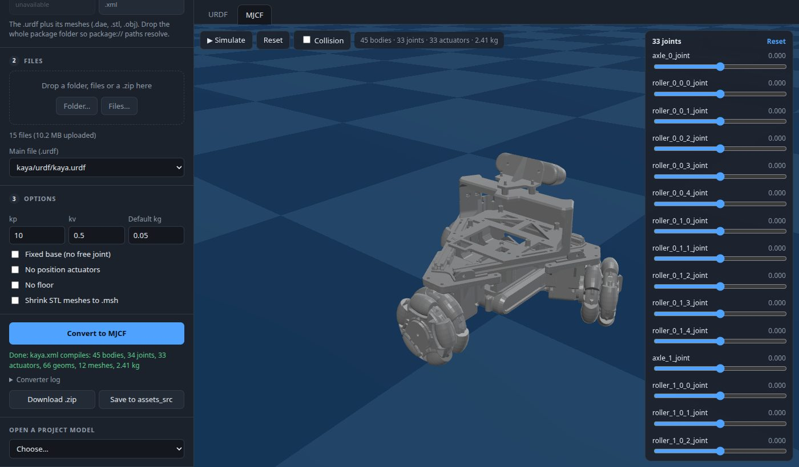

# Converter page

A local web page that turns a robot description into an MJCF model. Pick the
description type, drop in the files and convert. The source URDF and the
resulting MuJoCo model are both drawn on the page, so you can check the
result before it goes into `public/assets/`.



It runs the command-line converters described in
[model-tools.md](model-tools.md) on your machine, so it does the same
conversion and needs the same Python packages.

## Running it

```sh
npm install                                    # once: the page uses the repo's three.js and MuJoCo WASM
pip install -r tools/coppeliasim/requirements.txt
venv/bin/python tools/converter/server.py      # open http://localhost:8010/
```

Pass a port to use a different one (`server.py 8020`). The server only
listens on `localhost`. Stop it with Ctrl-C, which also deletes its work
folder (uploads and results, in a temporary folder printed at start-up).

## Converting a robot

1. **Pick the description type.**

   | Type | Upload | Needs |
   | --- | --- | --- |
   | URDF | the `.urdf` plus its meshes (`.dae`, `.stl`, `.obj`) | `mujoco`, `trimesh`, `pycollada` |
   | CoppeliaSim scene | a `.ttt` scene | the above, plus CoppeliaSim |
   | Isaac Sim USD | a `.usd` / `.usda` / `.usdc` articulation, like the Gecko | `usd-core`, `trimesh`, `scipy`, `fast_simplification` |
   | MJCF | an `.xml` model and its meshes | `mujoco` |

   A type whose requirements are missing is greyed out, and clicking it says
   what to install. CoppeliaSim is looked for at `$COPPELIASIM_ROOT` (the same
   default as the shell scripts).

2. **Add the files.** Drop a folder, several files or a `.zip` onto the
   page, or use **Folder…** / **Files…**. For a URDF, upload the whole
   package folder, so that `package://` and `../meshes/` paths resolve. If
   the selected type doesn't match the files, the page switches to one that
   does. When there are several candidates, choose the **Main file**.

   A URDF or MJCF is drawn as soon as it is uploaded. A scene or USD stage is
   drawn once it has been converted.

3. **Set the options.** They are the command-line converters' flags:

   | Option | Types | Flag |
   | --- | --- | --- |
   | Robot's root in the scene (model path), e.g. `/morf` | CoppeliaSim | `export_urdf.sh <scene> <model_path>` |
   | Also extract the scene's Lua scripts | CoppeliaSim | runs `extract_scripts.sh` |
   | Articulation root prim, e.g. `/Gecko` | USD | `usd_to_mjcf.py --root` |
   | Model name | CoppeliaSim, USD | output file name (default: the uploaded file's name) |
   | kp, kv | URDF, CoppeliaSim | `--kp`, `--kv` (position actuator gains) |
   | Default kg | URDF, CoppeliaSim | `--default-mass` (for links without inertial data) |
   | Fixed base | URDF, CoppeliaSim | `--fixed-base` |
   | No position actuators | URDF, CoppeliaSim | `--no-actuators` |
   | No floor | URDF, CoppeliaSim | `--no-floor` |
   | Shrink STL meshes to .msh | all | runs `stl_to_msh.py` on the result |

4. **Convert to MJCF.** The result is compiled with MuJoCo, and the status
   line gives its bodies, joints, actuators, meshes and total mass. If
   conversion fails, the **Converter log** opens with the converters'
   output. A CoppeliaSim scene takes a few seconds longer while CoppeliaSim
   starts headless.

5. **Keep the result.**
   - **Download .zip** gives `mujoco/` (the MJCF and its meshes), plus
     `urdf/` and `scripts/` for a CoppeliaSim scene.
   - **Save to assets_src** copies the same folders to
     `assets_src/<name>/`, the layout the CoppeliaSim scripts use. It asks
     before replacing folders that are already there.

   Then clean the model up and copy it to `public/assets/<name>/`, as in
   [adding-a-robot.md](adding-a-robot.md).

## The viewers

**URDF tab.** The source robot, drawn with
[urdf-loader](https://github.com/gkjohnson/urdf-loader). There is a slider
for each movable joint (continuous joints get ±π), **Reset joints** to put
them back at zero, and **Collision** to overlay the collision shapes in
translucent orange. The info line counts links and joints, and any meshes
it couldn't find (hover over it for their names).

**MJCF tab.** The model compiled by MuJoCo in the browser, drawn with the
simulator's own [src/render/geoms.js](../src/render/geoms.js), so it looks
as it will on the site.

- While paused, the sliders set the joint angles directly.
- **Simulate** runs the physics. The sliders then set the targets of the
  joints' position actuators, which start out holding the current pose.
  Joints without an actuator are greyed out.
- **Reset** goes back to the model's first keyframe, or its default pose.
- **Collision** shows or hides the collision geoms when the model also has
  visual-only geoms. When every geom collides, they are always shown.

**Open a project model** (bottom of the side panel) draws a model already in
the project: any `public/assets/*/*.xml`, `assets_src/*/urdf/*.urdf` or
`assets_src/*/mujoco/*.xml`.

## Things to know

- **URDF colours are dropped.** MuJoCo's URDF importer doesn't keep URDF
  material colours, so the MJCF comes out grey. Set colours in the MJCF
  during clean-up.
- **Errors in the URDF itself** show up in the log as MuJoCo's message, for
  example `XML Error: bad format in attribute 'xyz'` with the line number.
- **USD conversion** is the Gecko's converter: it expects an Isaac Sim style
  articulation with Z-axis revolute joints. Its MJCF holds collision hulls
  only; the full visual meshes go to `<name>_visual.glb`, which the page
  doesn't draw.
- **The Unitree B1 converter** (`b1_to_mjcf.py`) isn't on the page because
  it is specific to the B1. Run it from the command line.
- **No embedded scripts found** in the log means `extract_scripts.sh` found
  nothing to dump in the scene. This happens with
  `MORF_BasicLocomotionLearning.ttt`.

## How it works

| File | What it is |
| --- | --- |
| [tools/converter/server.py](../tools/converter/server.py) | Python standard-library HTTP server: uploads, running the converters, downloads |
| [tools/converter/index.html](../tools/converter/index.html) | The page's layout and styles |
| [tools/converter/app.js](../tools/converter/app.js) | Side panel: types, uploads, options, convert, save |
| [tools/converter/viewers.js](../tools/converter/viewers.js) | The URDF and MJCF viewers |

Each set of uploaded files is a *job*, with a folder of its own in the work
folder: `input/` for the uploads, `mujoco/` for the result, and `urdf/` and
`scripts/` for a CoppeliaSim scene. Uploading new files starts a new job.

| Request | Does |
| --- | --- |
| `GET /api/types` | The description types, and why any can't run here |
| `GET /api/library` | The project's existing models |
| `POST /api/jobs` | Starts a job |
| `PUT /api/jobs/<id>/input/<path>` | Uploads one file (a `.zip` is unpacked) |
| `POST /api/jobs/<id>/files` | Lists the job's uploaded files |
| `POST /api/jobs/<id>/convert` | Runs the converter: `{ type, main, options }` → `{ ok, log, mjcf, urdf }` |
| `GET /api/jobs/<id>/download` | The result as a `.zip` |
| `POST /api/jobs/<id>/save` | Copies the result to `assets_src/<name>/` |
| `GET /api/mesh?urdf=…&file=…` | A URDF's mesh, found the way `urdf_to_mjcf.py` finds it |

The converters run as subprocesses with the server's own Python
(`sys.executable`), which is why the server should be started with the venv's
Python. The page loads three.js and MuJoCo WASM from the repo's
`node_modules/`, and urdf-loader from jsDelivr.

To see a URDF's meshes, the page points every `<mesh filename>` at
`/api/mesh`. That uses `resolve_mesh` from `urdf_to_mjcf.py`, so the viewer
and the converter find the same file. The lookup tries the path relative to
the URDF, then the `package://` package in a folder above it, then the file
name next to the URDF (CoppeliaSim writes absolute paths from the exporting
machine). Failing those, it takes the best name match anywhere in the
upload.

For the MJCF view, the page reads the model's XML and fetches the files it
references (meshes, textures, height fields, skins and `<include>`d files,
using the `<compiler>` directories). It writes them into MuJoCo's in-memory
file system and compiles the model there.
