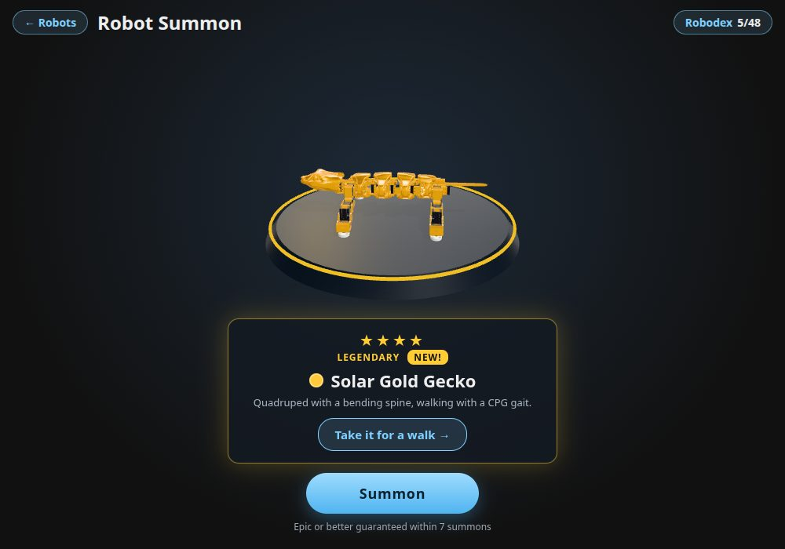

# Robot Summon

A gacha-style page, separate from the simulator, where you open a box to get
a random robot in a random colour variant, and collect them all. It lives at
`summon.html`, linked from the **Robot Summon** card at the bottom of the
robot menu.

## Using it

- **Summon** opens a box. It drops onto the pedestal and shakes three times
  while light leaks from under its lid. For rarer pulls the light steps up
  through the tier colours (blue, then purple, then gold) before the lid
  flies off. Tap anywhere to skip to the reveal.
- The robot then turns on the pedestal, which is ringed in its tier's colour.
  The result card shows its stars, tier, a **New!** badge or how many times
  you have it (**×3**), and its name, such as "Prism MORF".
- **Take it for a walk** opens that robot in the simulator in the colour you
  summoned, including the metal, glow or colour-cycling finish.
- **Screenshot** saves a picture to share: a 1080 x 1350 PNG of the robot
  on its pedestal, with its stars, tier, name and description, and the lab
  logo. It's named after the pull, such as `prism-red-mirror.png`. On phones
  the share sheet opens instead (where the browser can share files), so it
  can go straight to Photos or a chat.
- **Robodex** (top right, with your count, such as 12/48) lists every robot
  and variant. Ones you haven't caught show as "?" with their tier's border.
  Click a caught one to put it back on the pedestal.

## Odds

Each summon picks a robot at random (all equally likely), then a tier by the
odds below, then one of that tier's variants (all equally likely).

| Tier | Chance | Variants | Finish |
| --- | --- | --- | --- |
| Common ★ | 60% | Crimson, Tangerine, Lemon, Leaf, Sky, Graphite | Matte |
| Rare ★★ | 28% | Sakura, Mint, Lavender, Ocean | Glossy |
| Epic ★★★ | 10% | Chrome, Rose Gold, Cobalt | Metallic |
| Legendary ★★★★ | 2% | Solar Gold, Void, Prism | Animated: Solar Gold and Void glow and pulse, Prism cycles through colours |

**Pity:** if 9 summons in a row are below Epic, the 10th is guaranteed Epic
or Legendary, in the same 10 : 2 ratio as the normal odds. The line under the
Summon button counts down to it.

With 3 robots and 16 variants each, the full Robodex is 48.

## Where progress is kept

The collection and the pity counter are kept in the browser's
`localStorage` under `summon:collection`. They are per browser and per
device, and clearing site data resets them. If storage is unavailable (some
private windows), summons still work but are forgotten when the page closes.

## Variant links

"Take it for a walk" links to `?robot=<name>&variant=<id>`, for example
`?robot=gecko&variant=chrome`. Any robot page link accepts `variant`, so a
summoned robot can be shared. The robot page
([src/paint.js](../src/paint.js)) then:

- paints the robot's body in that variant, finish and animation included;
- remembers the variant's colour as the robot's body colour, as the Body
  colour picker does;
- drops the finish and removes `variant` from the URL as soon as another
  colour is picked, so a reload keeps the new choice.

The variant ids are the `id` values in
[src/summon/variants.js](../src/summon/variants.js).

## How it works

| File | What it does |
| --- | --- |
| [summon.html](../summon.html) | The page and its styles, including the box animation |
| [src/summon/main.js](../src/summon/main.js) | Start-up, the summon flow, the result card and the Robodex |
| [src/summon/variants.js](../src/summon/variants.js) | The tiers, the variants, the roll, pity, the saved collection, and the finishes (shared with the robot page) |
| [src/summon/stage.js](../src/summon/stage.js) | The 3D pedestal: loads each robot and shows it on a turntable |
| [src/summon/screenshot.js](../src/summon/screenshot.js) | The Screenshot button's picture: the stage drawn at a fixed size, plus the card and logo |

Vite builds `summon.html` as a second page next to `index.html` (see
`build.rollupOptions.input` in [vite.config.js](../vite.config.js)), so it
deploys with the rest of the site.

**No simulation runs.** The page loads the MuJoCo engine and each robot's
MJCF model (and its `VISUALS` glTF if it has one), poses the robot once and
draws it with the same code as the simulator
([src/render/geoms.js](../src/render/geoms.js),
[src/render/visuals.js](../src/render/visuals.js)). It doesn't load Pyodide
or call any controller, so it starts much faster than a robot page.

**The pose is the model's start pose:** its first `<keyframe>` if it has one,
otherwise every joint at zero. Red Mirror has a `stand` keyframe for this
reason: at zero its legs stick straight out. The robot page and
`python/run_local.py` start from the same keyframe.

**Colours go on the `printed` material**, the same parts the Body colour
picker recolours: an MJCF `<material name="printed">` (MORF, Red Mirror) or
the material of that name in the `VISUALS` file (Gecko). A variant sets the
material's colour, roughness, metalness and glow. Other parts keep their own
colours.

**Loading.** The Summon button works as soon as the engine is ready. The
robots are then prepared one at a time in the background, each with its
shaders compiled ahead of its first reveal. A robot summoned before it's
ready is prepared during the box animation. Models are compiled through
Emscripten's in-memory file system (`compileModel` in
[src/simulation.js](../src/simulation.js)). The other way to hand MuJoCo
mesh files, `MjVFS.addBuffer`, copies them byte by byte and froze the page
for seconds. Compiling still takes a moment: about 0.1 s for Gecko, 0.2 s for
MORF and 0.55 s for Red Mirror on a desktop CPU.

## Changing it

- **Odds:** `weight` in `TIERS` in
  [variants.js](../src/summon/variants.js). The weights are relative, so they
  don't need to add up to 100.
- **Pity:** `PITY` in the same file.
- **Variants:** add or edit entries in `VARIANTS`. Each has an `id` (used in
  the saved collection and in `?variant=` links, so don't rename existing
  ones), a `name`, a `tier`, a `color`, and `roughness` / `metalness`.
  Optional: `glow` (a colour that pulses) or `prism: true` (cycling colour).
  The Robodex grows with the list. Its hint text says "16 colours", so update
  that in [summon.html](../summon.html) if the count changes.
- **Which robots:** every robot on the robot menu is in the pool, except the
  names in `EXCLUDED` in [main.js](../src/summon/main.js) (currently `b1`,
  which has no controller yet). Robots with `HIDDEN = True` are left out too.

## Adding a robot to the pool

A new robot joins automatically once it shows up on the robot menu (see
[adding-a-robot.md](adding-a-robot.md)). To look right on the pedestal it
needs:

- **a `printed` material** on its body parts, or the variants won't change
  its colour;
- **a standing start pose**. If the robot only stands once its controller
  runs, add a `<keyframe>` with the standing `qpos` (and matching `ctrl`)
  to its MJCF. One way to get the values is to set the controller's rest
  targets, let the model settle for a few seconds in MuJoCo, and copy
  `data.qpos`. That's how Red Mirror's `stand` keyframe was made.

The robot is scaled to fit the pedestal, so its size doesn't matter.
